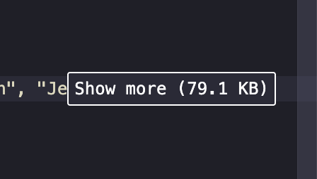
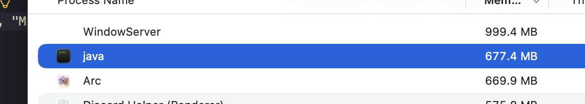

# 중간 연산 과다 사용 / Overusing Intermediate Operations

> 4. Overusing Intermediate Operations:Mistake: Chaining too many intermediate operations (like filter() and map()) can introduce performance overhead.

## 1. 개요: 중간 연산 과다 사용 (Overusing Intermediate Operations)
스트림 API 사용 시 `filter()`나 `map()`과 같은 중간 연산을 여러개 사용 하는 것은 코드의 가독성을 높일 수 있으나, 시스템의 성능에 영향을 미칠 가능성이 있습니다.

### 로직 구현 방식 비교
    
* m1 (비효율): 연산을 단계별로 분리하여 4개의 중간 스트림 생성

    ```Java
    static void m1() {
        List<String> result = names.stream()
        .filter(name -> name.startsWith("A"))
        .filter(name -> name.length() > 3)
        .map(String::toUpperCase)
        .map(name -> name + " is a name")
        .toList();

        //System.out.println(result);
    }
    ```

* m2 (효율): 논리 연산자 (`&&`)와 문자열 결합을 통해 연산 단계를 2개로 통합

    ```Java
    static void m2() {
        List <String> result = names.stream()
        .filter(name -> name.startsWith("A") && name.length() > 3)
        .map(name -> name.toUpperCase() + " is a name")
        .toList();

        //System.out.println(result);
    }
    ```

## 2. 이론적 배경: 오버헤드의 실체

중간 연산의 증가가 성능에 미치는 영향은 객체 생성 비용보다는 함수 실행 구조에 기인합니다.

* 객체 생성 영향: `filter()` 호출 시 생성되는 Stage 객체는 매우 가볍기 때문에 GC 부하에 미치는 영향은 적은 편입니다.

* 람다 호출 및 간접 참조: 스트림은 파이프라인의 각 단계마다 람다 함수를 호출하는 간접 참조 방식을 사용합니다. m1은 4회의 람다 호출, m2는 2회의 람다 호출이 발생하여 데이터 크기에 따라 호출 스택의 비용이 누적됩니다.

## 3. 성능 측정 실험 (Benchmark)

### 3.1 실험 환경

* 반복 횟수: 10, 100, 1000, 10000회 실행 (나노초 단위 측정)

* 워밍업: 20000회 (JIT 컴파일러 활성화 유도)

```Java
public class StreamAPILab {
    //예제 데이터 (부분 생략)
    static List<String> names = Arrays.asList("James", "Mary", "Robert", ...);

    public static void main(String[] args) {
        long totalTime = 0, beforeTime, afterTime;
        long maxTime = Long.MIN_VALUE, minTime = Long.MAX_VALUE;
        //반복 횟수
        final int START = 10000000;

        //워밍업
        for (int i = 0; i < 20000; i++) {
            m1();
            //m2();
        }

        //측정
        for (int i = 0; i < START; i++) {
            beforeTime = System.nanoTime();
            m1();
            //m2();
            afterTime = System.nanoTime();

            //시간 기록
            totalTime += afterTime - beforeTime;
            maxTime = Math.max(maxTime, afterTime - beforeTime);
            minTime = Math.min(minTime, afterTime - beforeTime);
        }

        System.out.println("Avg: " + (totalTime / START) + "ns");
        System.out.println("Max: " + maxTime + "ns");
        System.out.println("Min: " + minTime + "ns");
    }
}
```

### 3.2 데이터 규모별 성능 측정 결과 (Avg, ns)

| 데이터 크기 | 비효율 (m1) | 효율 (m2) | 효율 개선율 % |
| --- | --- | --- | --- |
| 10건 | 65 | 47 | 27.7% |
| 100건 | 134 | 107 | 20.2% |
| 1,000건 | 804 | 778 | 3.3% |
| 10,000건 | 6722 | 6716 | 0.1% |

## 4. 심층 분석: 성능 수렴의 원인

### 4.1 암달의 법칙 (Amdahl's Law)과 한계점


* 데이터가 적을 때는 로직 개선(중간 연산 통합)이 전체 성능의 큰 비중을 차지

* 데이터 규모가 커질수록 개선 불가능한 고정 비용이 큰 비중을 차지

    * 고정 비용: 스트림 엔진 구동, 데이터 소스 로드, 최종 연산

* 결과: 데이터가 10,000건에 도달하면 메모리 I/O와 최종 결과 도출 시간이 전체의 대부분을 점유하여 로직 개선 효과가 미미해짐

### 4.2 JVM의 자동 최적화 (JIT Inlining)

JVM은 반복 실행되는 비효율적 파이프라인 (m1)을 Hot Spot으로 인지하고 최적화를 수행합니다.

* 메소드 인라이닝: 4개로 쪼개진 연산을 런타임에 하나의 기계어 흐름으로 통합하여 m2와 유사한 물리적 구조로 변형

* 결과: 대용량 데이터에서 효율 차이가 0.1%로 수렴하는 것은 JVM이 스스로 비효율성을 보정했기 때문

## 5. 결론 및 인사이트

* 소규모 데이터에서는 중간 연산자 통합이 실질적인 성능 향상을 가져옴

* 대규모 데이터에서는 JVM의 최적화 능력이 오버헤드를 압도하므로, 성능보다는 가독성과 유지보수성을 고려한 설계가 유리

* 물리적 제약: 64KB 바이트코드 제한 등 JVM의 구조적 한계를 고려한 데이터 로드 전략이 필요

    * 데이터를 반복문이나 외부 파일 로딩이 아닌 코드에 직접 하드코딩하게 되면, 자바 가상 머신 (JVM)의 구조적 제한으로 인해 아래와 같은 에러를 마주하게 됨

        
        

* 10,000개의 짧은 문자열 자체의 크기는 작지만, 이를 하드코딩하면 JVM이 이를 관리하기 위해 수십 배의 메모리 관리 비용을 지불하게 됨...

    